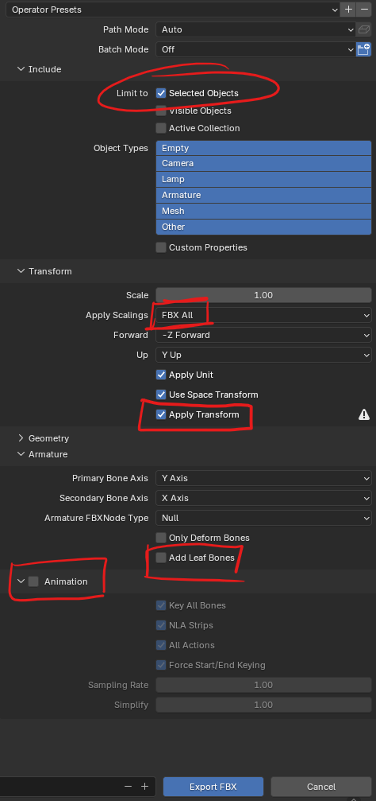
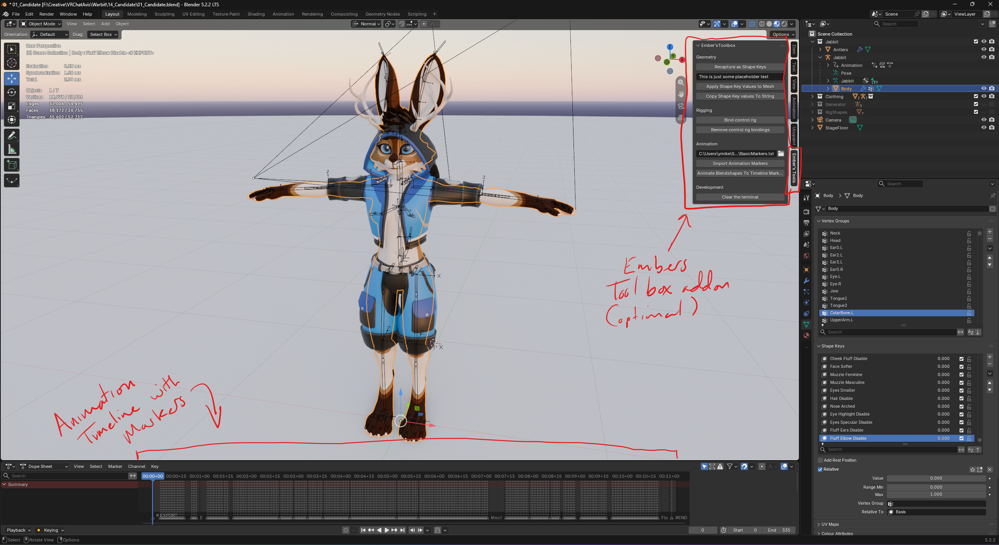
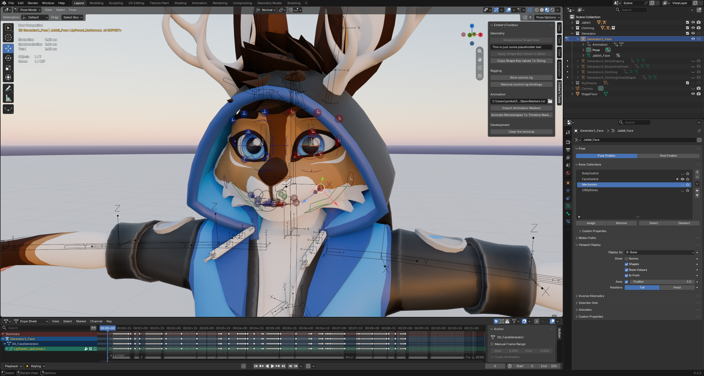

# Blender files

## Quick start

You should have the following blender files (made with Blender 5.2.2 LTS).

- Jabbit.blend

If you're just a regular user, then here's the quick version of what you need to know.
1. If you want to publish an update to the Jabbit.fbx in unity: 
Select `Jabbit`(**armature**) and `Body`(**mesh**) and export with the recommended settings below.
2. If you want to publish an update to the Antlers.fbx in unity 
Select `Antlers`(**mesh**) and export with the recommended settings below.
3. If you want to publish an update to the RaveWare.fbx in unity 
Select `RaveWare_Armature`(**armature**) and `RaveWare`(**mesh**) and export with the recommended settings below.

These are all the core elements you should be concerned with - everything else in the file is for powerusers/blender-artists

___
### Recommended export settings from blender

This sadly isn't covered enough so I'll reiterate it here. When you're ready to export your avatar from blender for Unity, these are the settings you should use. Select what you want then go up to the top left in blender. Click File > Export > FBX. These are the settings you should make sure are configured correctly:

Apply Scalings is the extremely important one. The FBX scaling system sadly is not followed universally across the 3D industry and blender defaults to what is a happy middle ground for most software but isn't strictly correct according to spec. "FBX All" is what it should be for your avatar to be correctly scaled in unity. If you leave it as default, check the size of the skeleton when you're next in unity and it should be 100 on all axis. This is wrong, it should be at a scale of 1 on all axis!

## For blender power users

Before openning and using any of these files, if you happen to be a content creator and wish to either make clothes of this avatar or alter the facial blend shapes, I recommend you install Ember's Toolbox into blender3D, which is available here: https://github.com/EmberBeard/EmbersBlenderToolbox - a copy of this should have been provided with the purchase though, incase this page were to ever be taken down.

Okay, but why and what is this addon?

Story time:
I ***HATE*** blendshapes. Conceptually they are fine and effective in game engines but they are destructive and obstructive to artistic workflows in blender. If you spend time making blendshapes you cannot use modifiers, not without other 3rd party addons which only work half the time anyway. Keeping them up to date is a pain too, as is the fiddliness of editing a blend shape only to realize you had a blendshape selected and now you're alterations are trapped in something you'll probably delete next. I wanted a more stable and reliable solution for making shapes. To that end, I made a generative rig system. Blender already allows you to save armature deformations as blendshapes, so I just took that concept and ran with it. The addon allows you to load a txt file as a list of animation markers and then animate an armature and save those poses tagged in the timeline as shapes. If you were to delete all blendshapes off the avatar, this tool would allow you to get them all back with a single button press.

All blendshapes for the Jabbit have been generated using rigs instead of sculpted. The face, body, clothing and chest swap shapes, each of them has a unique generator rig with animations attached. In the animation timeline there should be a series of markers that denote what shapes they correlate to. If you were to unhide the generator cateogries, you'll see a set of animation rigs.

Lets prove this out. Select the body mesh for the Jabbit avatar, go to it's Blend Shapes section, hit the drop down arrow and select "`Delete all`". This should obliterate all blendshape data.

Now let's just go and get it all back. Just go to the Ember's Tools panel in the side menu and click `Recapture As Shape Keys` at the very top

This only takes about 30 seconds (depending on how powerful your PC is). There's close to 200 animation markers to capture and convert into blendshapes across 4 different armatures. All Armature modifiers will be applied as a separate blenshape and then combined together. In a future update there'll be some sort of UI element to show how far through the process it is but for now, if you have blender set to launch with the command line window open, you'll see it capturing each frame one by one. After that's done you'll have every blendshape back.

As such, if you want to mess with the facial blend shapes for Face Tracking usage or mess with how the body deforms - I personally recommend you play with the generator rigs, as this infrastructure will handle the blendshapes (an entire complete face rig is provided as one of the generators). To do this you just have to unhide the generators layer and go into pose mode on whichever generator you want to mess with.

You can choose to ignore this advice though, one advantage you have over me is that your geometry should never change. A big benefit for me on this project with this was that I was still working out what polygons went where

This system also works for the RaveWare and any other blender project you want to use this addon in. You just need a mesh that has at least one armature modifier and some animation markers in the timeline (you can load that from a TXT file in this addon too with the `Import Animation Markers` button )

# FAQ
1. How does the face generator work? A: Under the armature tab, you should see multiple hidden bone layers. The Face Controlls is what you the artist should only be concerned with. The other three are purely for making the magic work. The face rig uses no blendshapes and is entirely bone/weightpaint driven, all of which should be ignored on export if you only have the body and the armature named Jabbit selected. The face rig uses bendy bones liberally which don't work in unity and should not be exported. If you want to tweak how the face rig works, make sure you're checking for drivers as they are used to automate some movements, like the eyelids flexing as you drag the eyelid control up and down. If you want a good primer on how to rig or handle rigs, look up "Humane Rigging Blender" on Youtube - for how old it is it's aged shockingly well and still holds up to modern blender standards.