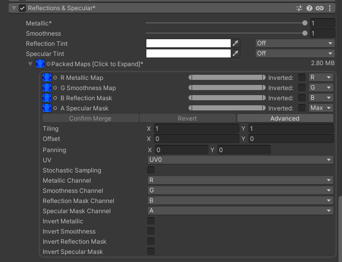

# Substance Painter

## Exporting from Substance Painter and materials in Unity

To get the nice shading effect you see on the default Jabbit - you can't use the "realistic" render mode on Poiyomi. Instead we recommend the "Wrapped" shading method with a provided smootheness map. Full credit and appreciation to **CheekyYena** for uncovering this.

There's a key advantage to this which is that - when the avatar has a bit of relfectivity that's toned and managed well, instead of looking like a mirror they just naturally integrate well with the lighting of the environment around them - because they are reflective - just very subtly. Here's a walk through for how to do this yourself not just with the Jabbit but with any other avatar you like in theory. However, this process starts all the way back in Substance painter before we get to Unity. Here's what you need to do after you've textured your Jabbit or other avatar:

1. Go to https://www.poiyomi.com/general/substance-painter - there should be a downloader for a substance painter export template. Go and download that.
   

2. Drag it from your downloads folder into your Substance Painter Assets window - the poiyommi template will now be available at export.

3. Export your textures using the "Unity Poiyomi" template you have installed. This will give you a "MetalicSmoothnessMap" in addition to all your other necessities.

The one thing to be aware of is that since the Jabbit uses a split chest where the geometry for the pectorals swaps in and out - the Ambient occlusion baking in Substance isn't that good. There should already be a hand painted texture in the unity project called "AO_Jabbit_Handpaint". It is recommended you just use that.

## Using these textures in unity

We will cover the material side of things for unity in the substance painter section too as they're really one and the same as far as texture art goes. So...

1. In Unity now, once you've dragged your textures in there, make your material for your avatar and set it to be a "poiyomi toon" shader.

2. Under "Color & Normals" set your Albedo texture

3. Under "Shading -> Shading" change the lighting type to "Wrapped", then;
   
   1. set the Wrap value to 1.
   
   2. set the Normalization value to 0.3.

4. Enable the "Shading -> Reflections & Specular" section. Inside here you'll want to find the "Packed Maps" section. Open the dropdown and you should see a whole list of settings. What we want to do now is set our "MetalicSmoothnessMap" to be the texture used in the following 3 slots:
   
   1. R Metalic Map
   
   2. G Smoothness Map
   
   3. B Reflection Mask

5. After setting these 3 texture slots, make sure to change the fallback dropdown on the right of them from "MAX" to R, G and B respectively. This way it will sample the Metalic value from the R channel, Smoothness from G and Reflection from B.

6. Then just hit the "Confirm Merge" button. Poiyomi will take all that data and generate a new texture next to your material called the Material `MaterialName_MochieMetallicMaps`. For clarity your Reflection & Specular section should look like this:
   

7. The last step is to go below this "Packed Maps" section and to the "Reflection Visiblity" slider - turn that up all the way to 1.

You should now have a material that integrates your avatar very nicely into whatever lighting condition you find yourself in with a subtle reflection trick. A word of caution though: Do NOT delete the generated `MochieMetallicMaps` texture, it is used by the poiyomi material now and forevermore. If you delete it you'll have to combine your textures again.