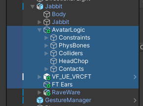

# Unity

## Pre-requisits

Before openning the project in Unity, you will require the following packages - for the ones you will need to downloaded it is recommended you click the "Add to VCC" button to integrate them into the VRChat Creator Companion tool. This way updates can be easily re-integrated:

| Module                                                                                                                                                             | Version number (minimum) | Download links                                         |
| ------------------------------------------------------------------------------------------------------------------------------------------------------------------ | ------------------------ | ------------------------------------------------------ |
| **Av3 Emulator**  (this allows you to test in editor)                                                                                                      | 3.413                    | NA (Curated in the Companion app)                      |
| **Poiyomi Toon Shader**  (this allows for better shading in game)                                                                                          | 10.0.16                  | https://www.poiyomi.com/download                       |
| **VRCFury**  (this is a core set of additional logic that allows things to easily plug together in editor)                                             | 1.1426                   | https://vrcfury.com/download                           |
| **Audio link**  You will get this anyway for free in game but this package allows you to preview and effectively tweak your work in editor         | 3.12                     | NA (Curated in the Companion app)                      |
| **VRCFT - Jerry's Templates**  (This is the default face tracking control system used and supported - but Pawligon should also work if you prefer) | 7.0.5                    | https://adjerry91.github.io/VRCFaceTracking-Templates/ |

## Exploring the avatar

Start by openning `Assets/Avatars/Jabbit/JabbitScene.unity`.

With the excpetion of the Avatar Descriptor component which is found on the root of the avatar. All logic for the avatar can be found underneath the AvatarLogic game object. The only two excpetions to this are the VF_UE_VRCFT template from Jerry's Face Tracking and the FTEars game object which has the controller for the rabbit's ears. This is split out to make replacement by other facetracking developers easier to replace.

