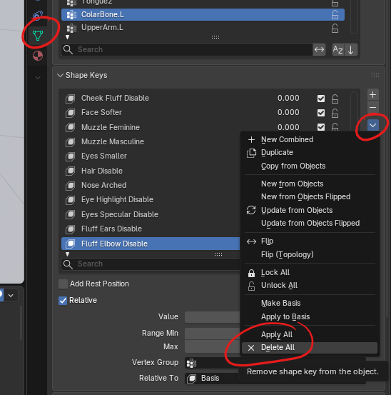
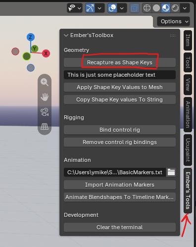
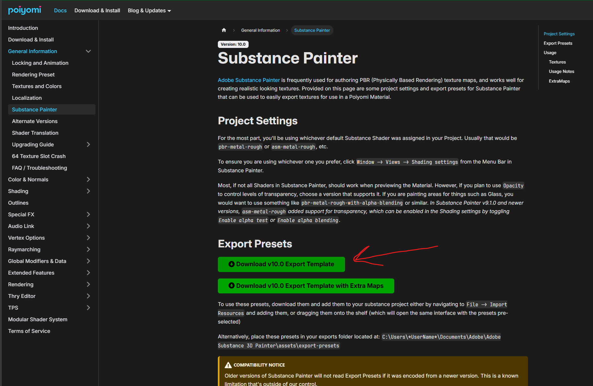

# Jabbit Documentation

# Introduction

Thanks for purchasing the Jabbit. Here's the full technical documentation for your avatar and associated files. If you wish to stay up to date with the latest version of this documentation it can be found and read here: https://github.com/EmberBeard/Jabbit-Documentation/tree/main

## Table of contents

1. [Introduction](#Introduction)

2. [Blender files](#Blenderfiles)

3. [Substance Painter files](#SubstancePainterfiles)

4. [Unity](#Unity)

# Blender files

## Quick start

You should have the following blender files (made with Blender 5.2.2 LTS).

- Jabbit.blend

If you're just a regular user, then here's the quick version of what you need to know.
1. If you want to publish an update to the Jabbit.fbx in unity: 
Select `Jabbit`(**armature**) and `Body`(**mesh**) and export with the recommended settings below.
2. If you want to publish an update to the Antlers.fbx in unity 
Select `Antlers`(**mesh**) and export with the recommended settings below.
3. If you want to publish an update to the RaveWare.fbx in unity 
Select `RaveWare_Armature`(**armature**) and `RaveWare`(**mesh**) and export with the recommended settings below.

These are all the core elements you should be concerned with - everything else in the file is for powerusers/blender-artists

___
### Recommended export settings from blender

This sadly isn't covered enough so I'll reiterate it here. When you're ready to export your avatar from blender for Unity, these are the settings you should use. Select what you want then go up to the top left in blender. Click File > Export > FBX. These are the settings you should make sure are configured correctly:

Apply Scalings is the extremely important one. The FBX scaling system sadly is not followed universally across the 3D industry and blender defaults to what is a happy middle ground for most software but isn't strictly correct according to spec. "FBX All" is what it should be for your avatar to be correctly scaled in unity. If you leave it as default, check the size of the skeleton when you're next in unity and it should be 100 on all axis. This is wrong, it should be at a scale of 1 on all axis!

## For blender power users

Before openning and using any of these files, if you happen to be a content creator and wish to either make clothes of this avatar or alter the facial blend shapes, I recommend you install Ember's Toolbox into blender3D, which is available here: https://github.com/EmberBeard/EmbersBlenderToolbox - a copy of this should have been provided with the purchase though, incase this page were to ever be taken down.

Okay, but why and what is this addon?

Story time:
I ***HATE*** blendshapes. Conceptually they are fine and effective in game engines but they are destructive and obstructive to artistic workflows in blender. If you spend time making blendshapes you cannot use modifiers, not without other 3rd party addons which only work half the time anyway. Keeping them up to date is a pain too, as is the fiddliness of editing a blend shape only to realize you had a blendshape selected and now you're alterations are trapped in something you'll probably delete next. I wanted a more stable and reliable solution for making shapes. To that end, I made a generative rig system. Blender already allows you to save armature deformations as blendshapes, so I just took that concept and ran with it. The addon allows you to load a txt file as a list of animation markers and then animate an armature and save those poses tagged in the timeline as shapes. If you were to delete all blendshapes off the avatar, this tool would allow you to get them all back with a single button press.

All blendshapes for the Jabbit have been generated using rigs instead of sculpted. The face, body, clothing and chest swap shapes, each of them has a unique generator rig with animations attached. In the animation timeline there should be a series of markers that denote what shapes they correlate to. If you were to unhide the generator cateogries, you'll see a set of animation rigs.

Lets prove this out. Select the body mesh for the Jabbit avatar, go to it's Blend Shapes section, hit the drop down arrow and select "`Delete all`". This should obliterate all blendshape data.

Now let's just go and get it all back. Just go to the Ember's Tools panel in the side menu and click `Recapture As Shape Keys` at the very top

This only takes about a minute (depending on how powerful your PC is). There's close to 200 animation markers to capture and convert into blendshapes across 4 different armatures. All Armature modifiers will be applied as a separate blenshape and then combined together. I want to add a UI element to show how far through the process it is but for now, if you have blender set to launch with the command line window open, you'll see it capturing each frame one by one. After that's done you'll have every blendshape back.

This system also works for the RaveWare and any other blender project you want to use this addon in. You just need a mesh that has at least one armature modifier and some animation markers in the timeline (you can load that from a TXT file in this addon too with the `Import Animation Markers` button )

# Substance Painter files

## Exporting from Substance Painter and materials in Unity

To get the nice shading effect you see on the default Jabbit - you can't use the "realistic" render mode on Poiyomi. Instead we recommend the "Wrapped" shading method with a provided smootheness map. There's a key advantage to this which is that - when the avatar has a bit of relfectivity that's toned and managed well, instead of looking like a mirror they just naturally catch and integrate well with the lighting of the environment around them - because they are reflective - just very subtly. Here's a walk through for how to do this yourself not just with the Jabbit but with any other avatar you like in theory. However, this process starts all the way back in Substance painter before we get to Unity. Here's what you need to do after you've textured your Jabbit or other avatar:

1. Go to https://www.poiyomi.com/general/substance-painter - there should be a downloader for a substance painter export template. Go and download that.
   

2. Drag it from your downloads folder into your Substance Painter Assets window

3. Export your textures using the "Unity Poiyomi" tempalte you have installed. This will give you a "MetalicSmoothnessMap".

4. In Unity now, once you've dragged your textures in there, make your material for your avatar and set it to be a "poiyomi toon" shader.

5. Under "Color & Normals" set your Albedo texture

6. Under "Shading -> Shading" change the lighting type to "Wrapped", then;
   
   1. set the Wrap value to 1.
   
   2. set the Normalization value to 0.3.

7. Enable the "Shading -> Reflections & Specular" section. Inside here you'll want to find the "Packed Maps" section. Open the dropdown and you should see a whole list of settings. What we want to do now is set our "MetalicSmoothnessMap" to be the texture used in the following 3 slots:
   
   1. R Metalic Map
   
   2. G Smoothness Map
   
   3. B Reflection Mask

8. After setting these 3 texture slots, make sure to change the fallback dropdown on the right of them from "MAX" to R, G and B respectively. This way it will sample the Metalic value from the R channel, Smoothness from G and Reflection from B.

9. Then just hit the "Confirm Merge" button. Poiyomi will take all that data and generate a new texture next to your material calle dthe Material Name_MochieMetallicMaps. More on this later.

10. The last step is to go below this "Packed Maps" section and to the "Reflection Visiblity" slider - turn that up all the way to 1.

You should now have a material that integrates your avatar very nicely into whatever lighting condition you find yourself in with a subtle reflection trick. A word of caution though: Do NOT delete the generated texture, it is used by the material.

# Unity

## Pre-requisits

Before openning the project in Unity, you will require the following packages - for the ones you will need to downloaded it is recommended you click the "Add to VCC" button to integrate them into the VRChat Creator Companion tool. This way updates can be easily re-integrated:

| Module                                                                                                                                                             | Version number (minimum) | Download links                                         |
| ------------------------------------------------------------------------------------------------------------------------------------------------------------------ | ------------------------ | ------------------------------------------------------ |
| **Av3 Emulator**  (this allows you to test in editor)                                                                                                      | 3.413                    | NA (Curated in the Companion app)                      |
| **Poiyomi Toon Shader**  (this allows for better shading in game)                                                                                          | 10.0.16                  | https://www.poiyomi.com/download                       |
| **VRCFury**  (this is a core set of additional logic that allows things to easily plug together in editor)                                             | 1.1426                   | https://vrcfury.com/download                           |
| **Audio link**  You will get this anyway for free in game but this package allows you to preview and effectively tweak your work in editor         | 3.12                     | NA (Curated in the Companion app)                      |
| **VRCFT - Jerry's Templates**  (This is the default face tracking control system used and supported - but Pawligon should also work if you prefer) | 7.0.5                    | https://adjerry91.github.io/VRCFaceTracking-Templates/ |

## Exploring the avatar

Start by openning `Assets/Avatars/Jabbit/JabbitScene.unity`.

With the excpetion of the Avatar Descriptor component which is found on the root of the avatar. All logic for the avatar can be found underneath the AvatarLogic game object. The only two excpetions to this are the VF_UE_VRCFT template from Jerry's Face Tracking and the FTEars game object which has the controller for the rabbit's ears. This is split out to make replacement by other facetracking developers easier to replace.

